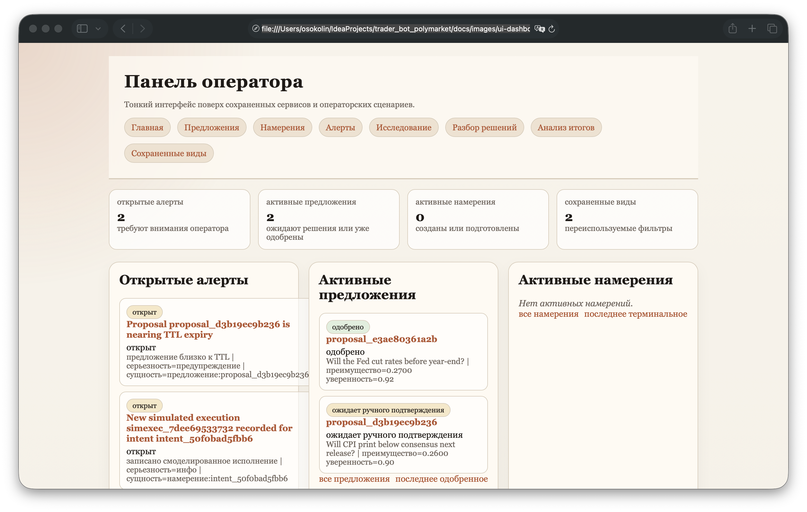
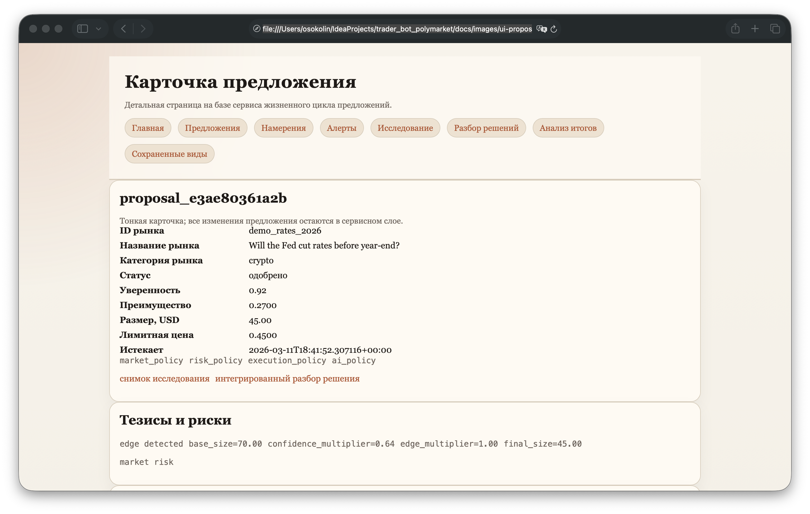
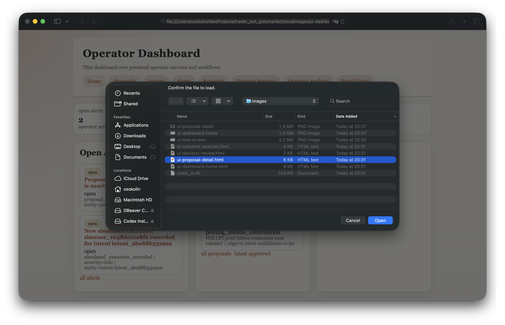
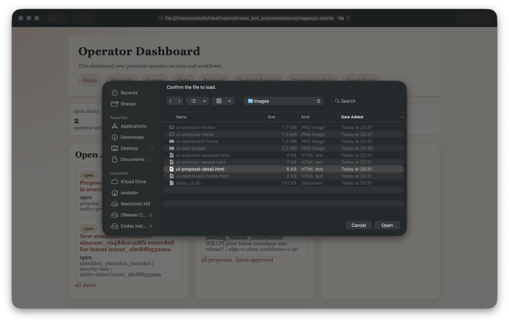

# Polymarket AI Bot

Полу­автомати­ческий operator-assistant для торговли на Polymarket-style рынках.
Архитектура — **policy-first**, режим — **semi_auto**, реальное исполнение
ордеров **выключено по умолчанию**.

Бот не торгует сам. Он собирает рыночные данные, формирует кандидатные
proposals, прогоняет их через слой политик, складывает в decision inbox и ждёт
ручного подтверждения оператором через CLI / Web UI / Telegram. Любой ответ
извне (Polymarket, веб-сокеты) на которое нельзя положиться — обрабатывается
**fail-closed**.

---

## Жёсткие инварианты

Эти правила зашиты в код и в `.agents/architecture-guardrails.md`:

1. `architecture: policy-first`
2. `mode: semi_auto`
3. live-исполнение выключено
4. нет автономного исполнения (никаких автозаходов от модели)
5. CLI и UI — тонкие, бизнес-логика только в `bot/services/`
6. вся внешняя интеграция — только через `bot/adapters/`
7. при stale / malformed / недоступных внешних данных — fail-closed
8. без green-теста, review и security-проверки коммитов в `main` нет

См. [AGENTS.md](./AGENTS.md), `.agents/architecture-guardrails.md`.

---

## Что уже реализовано

- генерация proposals из рыночного контекста и вероятностных снапшотов;
- политики: market / risk / execution / AI-policy + `CompositePolicy`;
- полный lifecycle proposal: pending → approve / edit / reject / TTL-expiry /
  revalidate;
- адаптеры публичных API Polymarket: Gamma (метаданные), CLOB (`/book`,
  `/midpoint`, `/price`), market WebSocket с reconnect/backoff;
- кэш market snapshot и сверка cache-vs-live;
- persisted order intents и **симуляционный** execution pipeline (paper-fills с
  учётом bid/ask, latency, partial fills, expiry, отмен);
- decision review, execution evaluation, outcome analysis, reporting;
- алерты, watchlists, saved views, exports, digests;
- опциональный `PolymarketGateway` для metadata discovery и
  `execution-preview` (audit-only, не создаёт intents и не отправляет ордера);
- Signal Engine v1 (momentum-lag и mean-reversion как proposal-генераторы,
  legacy bidirectional / both-sides сценарии выключены);
- три operator-интерфейса (CLI, Web UI, Telegram) поверх одного сервисного
  слоя;
- веб-аутентификация с argon2-хешированием паролей, server-side-сессиями и
  remember-cookies;
- demo-сидер, smoke-тесты, миграции схемы.

Подробнее: [docs/ARCHITECTURE.md](./docs/ARCHITECTURE.md),
[docs/ARCHITECTURE_OVERVIEW.md](./docs/ARCHITECTURE_OVERVIEW.md),
[docs/ARCHITECTURE_RU.md](./docs/ARCHITECTURE_RU.md),
[docs/CONFIG_REFERENCE.md](./docs/CONFIG_REFERENCE.md),
[docs/SEMI_AUTO_WORKFLOW.md](./docs/SEMI_AUTO_WORKFLOW.md),
[docs/RUNBOOK.md](./docs/RUNBOOK.md), [docs/DEPLOY.md](./docs/DEPLOY.md).

---

## Архитектура верхнего уровня

```text
   market data (Gamma / CLOB / WS)
            │
            ▼
   probability + research snapshot
            │
            ▼
   proposal engine + sizing
            │
            ▼
   composite policy (market | risk | execution | ai)
            │
            ▼
   proposal lifecycle  ──►  decision inbox  ──►  operator review
                                                       │
                                                       ▼
                                               approve / reject / edit
                                                       │
                                                       ▼
                                          revalidation (fail-closed)
                                                       │
                                                       ▼
                                              order intent (semi_auto)
                                                       │
                                                       ▼
                                            paper execution simulation
                                                       │
                                                       ▼
                                 decision review · evaluation · outcome analysis
```

---

## Структура репозитория

```
bot/
  adapters/polymarket/   Gamma / CLOB / WebSocket / errors / models
  cli/                   CLI-приложение (entry point: `bot`)
  config/                загрузка YAML, профили, env-overrides, инварианты
  domain/                enum'ы и модели (proposals, intents, signals…)
  demo/                  demo-сидер локального операторского состояния
  integrations/          PolymarketGateway (опциональный execution boundary)
  policies/              market / risk / execution / ai / composite
  prompts/               текстовые шаблоны (без LLM в execution-пути)
  security/              trading_signer (изоляция приватного ключа)
  services/              вся бизнес-логика
    signals/             Signal Engine v1 (admission, scoring, engine)
    inbox_handlers/      обработчики decision inbox для разных типов запросов
  storage/               SQLite-схема, миграции, репозитории
  telegram/              Telegram-бот (router / formatter / actions / auth)
  ui/                    Web dashboard (server / app / presenter)
  utils/                 общие утилиты

config/
  base.yaml              базовая политика
  conservative.yaml | balanced.yaml | aggressive.yaml   профили
  whitelist.yaml | blacklist.yaml | sources.yaml

docs/                    архитектурные и операционные документы
scripts/dev              унифицированный entrypoint разработчика
tests/                   модульные и интеграционные тесты
```

### Ключевые сервисы (`bot/services/`)

`proposal_engine`, `proposal_lifecycle`, `policy_engine`, `sizing`,
`signals/*`, `market_data`, `market_catalog`, `market_research`,
`market_sync`, `market_opportunity_scanner`, `market_opportunity_alerts`,
`opportunity_proposal_bridge`, `realtime_market_feed`, `probability_engine`,
`execution_pipeline`, `execution_engine`, `execution_guard`,
`execution_preview`, `execution_evaluation`, `decision_inbox`,
`decision_review`, `outcome_analysis`, `analytics`, `reporting`,
`saved_views`, `audit_log`, `runtime_safety`, `polymarket_diagnostics`,
`web_auth`, `telegram_operator_service`, `operator_notifications`.

### Storage

SQLite, миграции в `bot/storage/migrations/` (`v001_initial`,
`v002_web_auth`, `v003_execution_previews`). Репозитории на каждый
агрегат: `proposals_repo`, `execution_repo`, `execution_preview_repo`,
`alerts_repo`, `reviews_repo`, `inbox_repo`, `views_repo`,
`market_data_repo`, `auth_repo`.

---

## Конфигурация

Конфиг — YAML в `config/`, поверх — профили и env-переменные с
префиксом `BOT_`. Полный референс — [docs/CONFIG_REFERENCE.md](./docs/CONFIG_REFERENCE.md).

Основные блоки `config/base.yaml`:

- `mode` — `paper | manual_only | semi_auto | live_small | live_full` (по
  умолчанию `semi_auto`, остальное жёстко ограничено инвариантами);
- `bankroll` — общий капитал, резерв, дневные/недельные лимиты потерь;
- `position_limits` — лимиты на позицию / тему / число открытых / нерешённый
  exposure;
- `market_filters` — allowed/blocked categories, мин. ликвидность, макс.
  спред, время до резолва, требование orderbook;
- `entry_rules` / `exit_rules` — пороги edge, confidence, agreement,
  условия выхода;
- `ai_policy` — AI **только скорит**, не размещает ордера;
- `approvals` — `manual_approval_required: true`,
  `auto_execute_disabled: true`, TTL proposal'а;
- `safety` — kill-switch, паузы по API-ошибкам / сериям убытков /
  неожиданному состоянию позиций;
- `market_opportunity_alerts` — категории/ключевые слова, пороги,
  `poll_interval_seconds`;
- `polymarket_gateway` — опциональный adapter boundary, по умолчанию
  выключен и в `dry_run`; секреты — только из env;
- `strategies` — Signal Engine v1: какие стратегии включены, пороги,
  жёсткие caps; legacy bidirectional/both-sides сценарии **отключены**.

Шаблон env-файла — [.env.example](./.env.example).

---

## Локальная установка

Требования: **Python 3.12+**.

```bash
python3 -m venv .venv
.venv/bin/pip install -e ".[dev]"
cp .env.example .env                       # опционально
export BOT_DATABASE_URL=sqlite:///bot.db   # изолированная БД для smoke-runs
.venv/bin/bot config validate
```

Альтернативный entry-point: `python -m bot.cli.app config validate`.

---

## Унифицированный entry-point разработчика

```bash
scripts/dev verify        # тесты + lint + targeted mypy + py_compile + config + seed
scripts/dev verify-fast   # то же, без config-validation и seed
scripts/dev test
scripts/dev config
scripts/dev seed
scripts/dev scan
scripts/dev doctor
```

Точечные команды:

```bash
.venv/bin/python -m ruff check bot tests scripts
.venv/bin/python -m mypy
.venv/bin/python -m unittest discover -s tests -v
.venv/bin/python -m py_compile $(find bot tests -name '*.py' | sort)
```

---

## CLI

Entry point — `bot` (см. `pyproject.toml`). Самые ходовые команды:

```bash
bot proposals list --scope active
bot proposals latest-approved
bot proposals decision-review <proposal_id>
bot proposals execution-preview <proposal_id>
bot proposals execution-preview-history <proposal_id> --limit 20

bot execution-previews list --scope failed --limit 20
bot execution-previews summary

bot intents list --scope terminal
bot intents latest-simulated

bot alerts list --state open
bot alerts scan-opportunities [--limit N]

bot markets catalog --scope active|closed|all [--limit N]
bot markets scan [--min-edge N] [--min-liquidity N] [--limit N]
bot markets draft-opportunities [--min-edge N] [--min-liquidity N] [--limit N]
bot markets live <market_id>
bot markets cache <market_id>
bot markets stream-once <market_id>

bot events catalog --scope active|closed|all [--limit N]

bot analysis outcomes --group-by market
bot portfolio summary
bot diagnostics polymarket
bot demo seed
```

`bot markets scan` — read-only поиск возможностей: считает
`edge = fair_probability - market_price`, фильтрует по абсолютной величине,
сортирует по edge и confidence.

`bot alerts scan-opportunities` — отдельная operator-команда для discovery
alerts: матчит категории/ключевые слова, проверяет high-liquidity и
resolving-soon пороги, дедуплицирует. Ничего не исполняет.

`bot markets draft-opportunities` — создаёт **только draft proposals** через
существующий lifecycle, никаких intents/orders.

---

## Web UI

UI — отдельная команда, требует предварительной настройки пароля:

```bash
set -a; source ~/.config/trader_bot_polymarket.env; set +a
BOT_UI_PASSWORD='choose-a-strong-password' \
  .venv/bin/bot auth set-password --username osokolin

.venv/bin/bot ui serve --host 127.0.0.1 --port 8080
```

Локально по plain HTTP оставляйте `BOT_UI_SECURE_COOKIES=false`.
В проде — secure cookies всегда включены, UI слушает только
`127.0.0.1:8080`, ходим через SSH-туннель.

Что есть в UI: dashboard home, proposals, intents, alerts, research,
probability snapshots, live market data, market catalog с saved browse
preferences, integrated decision review, outcome analysis, saved views,
страница безопасности (logout / revoke), экспорт страниц decision review /
execution evaluation / outcome analysis.

### Web Auth

- single-user (`osokolin`), пароль задаётся через `bot auth set-password`,
  в репозиторий не коммитится;
- argon2-cffi-хеши + server-side sessions + HttpOnly cookies;
- опциональный remember-browser cookie с серверным хешем токена;
- `/auth/security` — отзыв всех активных сессий и remember-токенов.

---

## Telegram operator inbox

```bash
.venv/bin/bot telegram serve
```

Env:

```bash
TELEGRAM_BOT_TOKEN=...
TELEGRAM_ALLOWED_CHAT_IDS=123456789,987654321
```

Команды: `/start`, `/help`, `/status`, `/diagnostics`, `/scan`, `/inbox`,
`/review`, `/review-next`, `/request <id>`, `/preview <request_id>`,
`/proposals`, `/proposal <id>`, `/approve <id>`, `/reject <id>`,
`/cancel <id>`, `/analysis <id>`, `/skip <request_id>`, `/alerts`.

Что важно:

- персистентная decision inbox: запросы оператора живут в БД, не в памяти
  процесса;
- `/review` + `/review-next` — последовательная очередь review-карточек;
- review-карточка для proposals показывает последний persisted
  `execution-preview` и hint (`OK` / `CAUTION` / `RISKY` / `NO PREVIEW`) —
  это **decision support**, hint-ы advisory, approval-семантика и
  `ManualExecutionGuard` не меняются;
- `/approve` / `/reject` / `/cancel` идут через сервисы lifecycle и
  decision-inbox, не дёргают lifecycle напрямую;
- автозапуск opportunity scan по `market_opportunity_alerts.poll_interval_seconds`.

Telegram остаётся execution-safe: не создаёт intents, не отправляет
ордера, не правит runtime/config.

---

## Polymarket gateway и execution preview

`PolymarketGateway` — опциональный slice (`bot/integrations/polymarket_gateway.py`),
выключен по умолчанию.

Принципы границы:

- стратегия / scoring / market binding / policy / review / calibration /
  dry-run остаются **источником истины**;
- gateway — только metadata discovery и execution plumbing;
- приватный ключ изолирован в `bot/security/trading_signer.py`;
- секреты только из env (`POLYMARKET_PRIVATE_KEY`, `POLYMARKET_API_KEY`,
  `POLYMARKET_API_SECRET`, `POLYMARKET_API_PASSPHRASE`);
- LLM/агентов в execution-пути нет;
- live-сабмит ордеров не включён.

Команда `bot proposals execution-preview <proposal_id>`:

- использует gateway для резолва market metadata и quote-предположений;
- возвращает структурированный preview;
- **персистит preview как audit-record** — отдельная таблица
  `execution_previews`;
- `dry_run=True`, intent не создаёт, ордер не отправляет, не ослабляет
  `ManualExecutionGuard`.

Тот же persisted-trail питает review:

- `/request <id>` и `/review-next` показывают актуальный preview-state;
- сигналы — `preview_ok`, `preview_warn`, `preview_failed`, `preview_missing`;
- `/preview <request_id>` или inline-кнопка `Preview` форсят свежий
  non-live preview.

Инспекция:

```bash
bot proposals execution-preview-history <proposal_id> --limit 20
bot execution-previews list --scope recent  --limit 20
bot execution-previews list --scope failed  --limit 20
bot execution-previews list --scope warnings --limit 20
bot execution-previews summary
```

---

## Live market data

Публичная market-data интеграция:

- Gamma API — метаданные market/event;
- CLOB REST — публичные `/book`, `/midpoint`, `/price`;
- public market WebSocket с reconnect/backoff и **fail-closed**
  receive-timeout'ом;
- cache-first inspection + явный refresh.

Approval revalidation **fail-closed**, если данные stale, malformed или
недоступны.

Никакой авторизованной торговли, user-channel'а, постинга ордеров — live
execution выключен.

---

## Diagnostics

```bash
.venv/bin/bot diagnostics polymarket
```

Проверяет: Gamma reachability · CLOB reachability · public WebSocket
handshake · resolved SQLite-коннект.

```text
Polymarket diagnostics

Gamma API .......... OK
CLOB REST .......... OK
WebSocket .......... FAIL (timeout)
Database ........... OK (sqlite ready)

Overall status ..... FAIL
```

---

## Demo workflow

```bash
.venv/bin/bot demo seed
.venv/bin/bot alerts list --state open
.venv/bin/bot proposals list --scope approved
.venv/bin/bot intents list --scope terminal
.venv/bin/bot markets live demo_rates_2026
.venv/bin/bot ui serve
```

Сидер заполняет локальный `bot.db`: pending/approved proposals,
prepared/simulated intents, alerts, watchlist, decision review snapshots,
execution evaluation snapshots, outcome analysis snapshots, пара saved
views.

---

## Production deployment

Текущая модель деплоя:

- источник — `main`;
- сервисы под пользователем `tg_bot`;
- project-local `.venv` для рантайма и обновлений;
- Telegram-бот и Web UI как user-level systemd-сервисы
  (`trader-bot-telegram.service`, `trader-bot-ui.service`);
- UI слушает только `127.0.0.1:8080`;
- наружу открыт только `22/tcp` (SSH-туннель к UI).

Цикл обновления:

1. `git fetch && git pull`
2. `pip install -e .` в `.venv`
3. `bot config validate`
4. `systemctl --user restart trader-bot-telegram.service trader-bot-ui.service`

Полный гайд — [docs/DEPLOY.md](./docs/DEPLOY.md), оперативный — [docs/RUNBOOK.md](./docs/RUNBOOK.md).

SSH-туннель к UI:

```bash
ssh -i ~/.ssh/id_ed25519 -L 8080:127.0.0.1:8080 tg_bot@<server>
# затем http://127.0.0.1:8080/login
```

---

## Multi-agent workflow

Репозиторий построен под structured multi-agent flow:

```
Planner → Architect → Implementer → Tester → Reviewer → Security → Committer
```

Все определения и workflow'ы — в `.agents/` (см. `.agents/README.md`,
`shared-context.md`, `architecture-guardrails.md`, `gates.md`). Гард-рейлы
архитектуры — обязательные, не рекомендации.

---

## Скриншоты UI






---

## Пакет

`pyproject.toml`:

- name: `polymarket-bot`
- python: `>=3.12`
- runtime deps: `PyYAML`, `httpx`, `websockets`, `argon2-cffi`
- dev deps: `pytest`, `ruff`, `mypy`, `types-PyYAML`
- entry point: `bot = bot.cli.app:main`

Версионирование — см. [CHANGELOG.md](./CHANGELOG.md).
